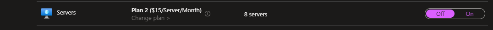
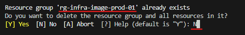

# Summery
PIM: Owner & Application Admin
```powershell
cd .\Documents\
git clone https://github.com/actions/runner-images.git
cd .\runner-images\
Import-Module .\helpers\GenerateResourcesAndImage.ps1

.\helpers\GenerateResourcesAndImage.ps1; GenerateResourcesAndImage `
-SubscriptionId 'd7909d2e-2a55-4c2f-b005-d700d0bc3e66' `
-ResourceGroupName 'rg-infra-image-prod-01' `
-AzureLocation 'westeurope' `
-ImageType 'Windows2022' `
-ManagedImageName ("image-agent-windows-$(Get-Date -Format "yyyy-MM-dd")").ToLower()
```

# Info VM Scale Sets

XXX använder sig av privata devops agenter. I och med att de behöver ha massa olika verktyg används en fullpackad image som microsoft använder. Tyvär får man inte en färdig image, den måste man bygga själv.

Den finns i repot `https://github.com/actions/runner-images` och deras guide finns under `https://github.com/actions/runner-images/blob/main/docs/create-image-and-azure-resources.md`
  
Här nedan beskrivs alla steg för att bygga och deploya en image, så man behöver inte läsa deras guide.

XXX använder linux agenter och windows agenter.
Man vill inte göra misstag här för att det tar flera timmar att bygga en image.

Det tar ~5 timmar att bygga windows image.
Helst ska det göras tidigt på morgonen och kontrolleras under tiden.
Det ska utföras på vmmgmtprod01. VM som ska bygga image måste ha git, packer, powershell och azure CLI.
VS Code är hjälpsam också. Förvissa dig om att VM inte stänger av sig själv.

Man måste stänga av defender, annars får man felet IMAGE_STATE_UNDEPLOYABLE.


Microsoft Defender for Cloud >  Environment settings > sub-infra-prod-01 > Servers > Off
Schemalagd pipeline kommer slå på den igen under natten.


Använder man SOC tjänst kommer förmodligen larm triggas, så det kan komma ärende från Orange. 

Subscription `sub-infra-prod-01` används.

WinRm och SSH används vilket innebär att port 5986 och 22 måste tillåtas.

Det ska utföras med ett personligt konto. 
Owner och Application Admin under 8 timmar krävs.

Klona repot:
`git clone https://github.com/actions/runner-images.git`

Placera dig i rätt mapp:
`Set-Location -Path 'runner-images'`

Importera modulen:
`Import-Module .\helpers\GenerateResourcesAndImage.ps1`

# Windows
Kör scriptet nedan för att skapa en image med Windows server 2022.
Scriptet skapar en tillfällig app registration och resurser som tas bort när allt är färdigt.
```powershell
.\helpers\GenerateResourcesAndImage.ps1; GenerateResourcesAndImage `
-SubscriptionId 'd7909d2e-2a55-4c2f-b005-d700d0bc3e66' `
-ResourceGroupName 'rg-infra-image-prod-01' `
-AzureLocation 'westeurope' `
-ImageType 'Windows2022' `
-ManagedImageName ("image-agent-windows-$(Get-Date -Format "yyyy-MM-dd")").ToLower()
```
# Linux
Kör scriptet nedan för att skapa en image med Ubuntu 22.04.
Scriptet skapar en tillfällig app registration och resurser som tas bort när allt är färdigt.
```powershell
.\helpers\GenerateResourcesAndImage.ps1; GenerateResourcesAndImage `
-SubscriptionId 'd7909d2e-2a55-4c2f-b005-d700d0bc3e66' `
-ResourceGroupName 'rg-infra-image-prod-01' `
-AzureLocation 'westeurope' `
-ImageType 'Ubuntu2204' `
-ManagedImageName ("image-agent-linux-$(Get-Date -Format "yyyy-MM-dd")").ToLower()
```
Resursgruppen finns redan. `N`


I ett perfekt scenario får man inga felmeddelande. Men det kan dyka upp något. Då trycker man på `r` för att fortsätta. Dyker det upp massa felmeddelanden då är det något fel. Testa en annan branch eller vänta att dem släpper en ny release.  


Här är ett windows-bygge som slutade efter 4.5 timmar. 

När bygget är klart, borde resurser rensas. Se till att det blev gjort. App registration heter ungefär `packer-0524A4E7-08AD-4443-A121-CA667C505506`. Resursgruppen heter ungefär `pkr-Resource-Group-6b3w4n0di5`.


Här är ett linux-bygge som misslyckades, pga. SSH. I det fallet inget farlig image dök upp i portalen och fungerade.


När images är färdiga kan man skapa virtuella maskiner av dem.


# Skapa en VM version

Gå till en image och klicka `Clone to a VM image` 


Fyll i versionen i formatet `yyyy.MM.dd` t.ex. `2024.04.22`
Välj befintlig galleri och definition.
Default storage sku: `Preminum SSD LRS`
Det kan ta ~30 minuter.


När image är klar och funkar. Kan man ta bort gamla versioner.


