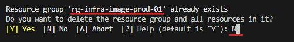
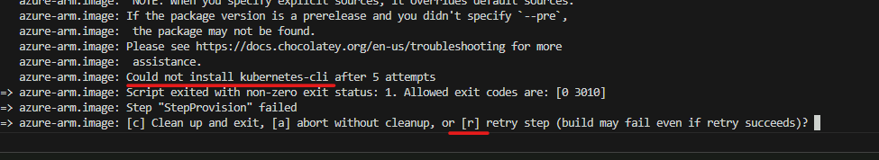
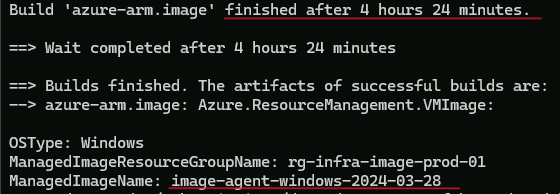
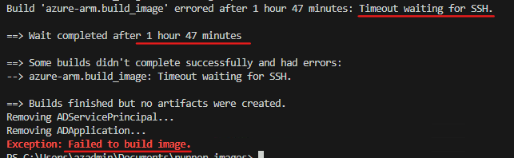
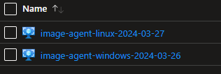
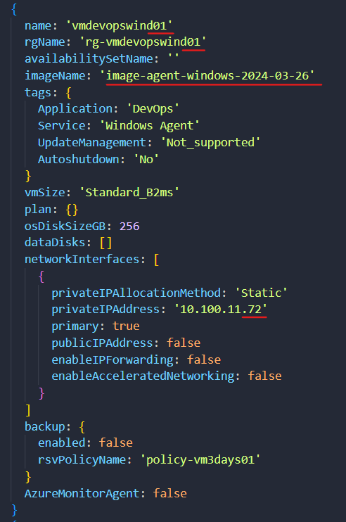
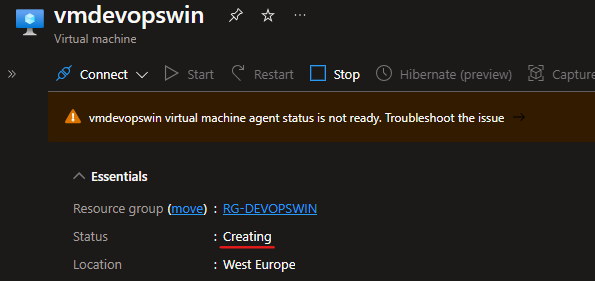
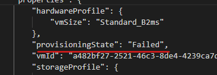
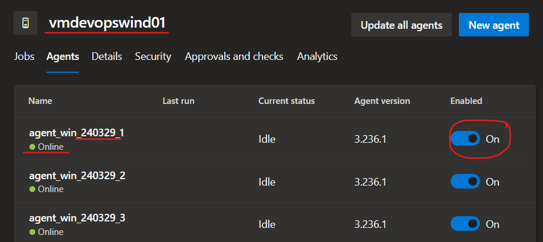
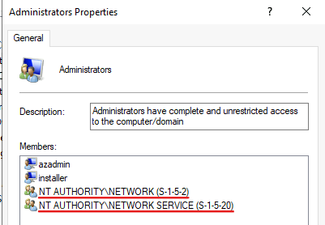

```powershell
# Download
https://vstsagentpackage.azureedge.net/agent/3.232.3/vsts-agent-win-x64-3.232.3.zip
# Install
./config.cmd --unattended --url "https://dev.azure.com/XXX" --auth "PAT" --token "XXXx75plrkvy52xq" --pool "vmmgmtprod0x" --agent "vmmgmtprod01-1" --work "_work" --runAsService --runAsAutoLogon --noRestart --windowsLogonAccount "NT AUTHORITY\NETWORK SERVICE"
# Remove
./config.cmd remove --auth "PAT" --token "XXXXsjqaej64k6txaskrxl37zujx75plrkvy52xq"
```
# Summery
PIM: Owner & Application Admin
```powershell
cd .\Documents\
git clone https://github.com/actions/runner-images.git
cd .\runner-images\
Import-Module .\helpers\GenerateResourcesAndImage.ps1

.\helpers\GenerateResourcesAndImage.ps1; GenerateResourcesAndImage `
-SubscriptionId 'd7909d2e-2a55-4c2f-b005-d700d0bc3e66' `
-ResourceGroupName 'rg-infra-image-prod-01' `
-AzureLocation 'westeurope' `
-ImageType 'Windows2022' `
-ManagedImageName ("image-agent-windows-$(Get-Date -Format "yyyy-MM-dd")").ToLower()
```
# Info Virtual Machines

XXX använder sig av privata devops agenter. I och med att de behöver ha massa olika verktyg används en fullpackad image som microsoft använder. Tyvär får man inte en färdig image, den måste man bygga själv.

Den finns i repot `https://github.com/actions/runner-images` och deras guide finns under `https://github.com/actions/runner-images/blob/main/docs/create-image-and-azure-resources.md`
  
Här nedan beskrivs alla steg för att bygga och deploya en image, så man behöver inte läsa deras guide.

XXX använder linux agenter och windows agenter.
Man vill inte göra misstag här för att det tar flera timmar att bygga en image.

Det tar ~5 timmar att bygga windows image.
Helst ska det göras tidigt på morgonen och kontrolleras under tiden.
Det ska utföras på vmmgmtprod01. VM som ska bygga image måste ha git, packer, powershell och azure CLI.
VS Code är hjälpsam också. Förvissa dig om att VM inte stänger av sig själv.

Man måste stänga av defender, annars får man felet IMAGE_STATE_UNDEPLOYABLE.


Microsoft Defender for Cloud >  Environment settings > sub-infra-prod-01 > Servers > Off

Schemalagd pipeline kommer slå på den igen under natten.


Använder man SOC tjänst kommer förmodligen larm triggas, så det kan komma ärende från Orange. 

Subscription `sub-infra-prod-01` används.

WinRm och SSH används vilket innebär att port 5986 och 22 måste tillåtas.

Det ska utföras med ett personligt konto. 
Owner och Application Admin under 8 timmar krävs.

Klona repot:
`git clone https://github.com/actions/runner-images.git`

Placera dig i rätt mapp:
`Set-Location -Path 'runner-images'`

Importera modulen:
`Import-Module .\helpers\GenerateResourcesAndImage.ps1`

# Windows
Kör scriptet nedan för att skapa en image med Windows server 2022.
Scriptet skapar en tillfällig app registration och resurser som tas bort när allt är färdigt.
```powershell
.\helpers\GenerateResourcesAndImage.ps1; GenerateResourcesAndImage `
-SubscriptionId 'd7909d2e-2a55-4c2f-b005-d700d0bc3e66' `
-ResourceGroupName 'rg-infra-image-agent-prod-01' `
-AzureLocation 'westeurope' `
-ImageType 'Windows2022' `
-ManagedImageName ("image-agent-$($ImageType)-$(Get-Date -Format "yyyy-MM-dd")").ToLower()
```
# Linux
Kör scriptet nedan för att skapa en image med Ubuntu 22.04.
Scriptet skapar en tillfällig app registration och resurser som tas bort när allt är färdigt.
```powershell
.\helpers\GenerateResourcesAndImage.ps1; GenerateResourcesAndImage `
-SubscriptionId 'd7909d2e-2a55-4c2f-b005-d700d0bc3e66' `
-ResourceGroupName 'rg-infra-image-prod-01' `
-AzureLocation 'westeurope' `
-ImageType 'Ubuntu2204' `
-ManagedImageName ("image-agent-linux-$(Get-Date -Format "yyyy-MM-dd")").ToLower()
```
Resursgruppen finns redan. `N`



I ett perfekt scenario får man inga felmeddelande. Men det kan dyka upp något. Då trycker man på `r` för att fortsätta. Dyker det upp massa felmeddelanden då är det något fel. Testa en annan branch eller vänta att dem släpper en ny release.  



Här är ett windows-bygge som slutade efter 4.5 timmar. 

När bygget är klart, borde resurser rensas. Se till att det blev gjort. App registration heter ungefär `packer-0524A4E7-08AD-4443-A121-CA667C505506`. Resursgruppen heter ungefär `pkr-Resource-Group-6b3w4n0di5`.



Här är ett linux-bygge som misslyckades, pga. SSH. I det fallet inget farlig image dök upp i portalen och fungerade.



När images är färdiga kan man skapa virtuella maskiner av dem.



# Deploya virtuella maskiner

Devops agenter finns endast i produktionsmiljön. Det finns en vm som kör windows `vmdevopswind0X` och en vm som kör ubuntu `vmdevopslinux0X`

Gå till repot `xxx-infra`. I parameterfilen ligger befintliga virtuella maskiner. Dem ska tas bort när man är klar med dem nya. 
Justera siffran i namnet till något som inte finns. Antingen 01 eller 02.
Peka på den nya imagen i parametern `imageName`
Ändra IP-adressen till en som inte är tagen.
Skjut ut koden.

  

Även om image blev skapad utan problem så kan det uppstå problem under deployment.
Om den nya virtuella maskinen har fastnat på `Creating` eller är i `Failed` tillstånd så kan det innebära att image blev korrupt. I så fall får man bygga en ny image.




# Installera devops agenter 
## Windows 
Öppna powershell 7 som admin. Placera dig på C:/

Hämta den senaste länken för zip filen. Klista in som $AgentUrl.

Skapa en Personal access token (PAT). Klistar in som $PAT.

Installationscriptet installerar 10 agenter. Man kan anpassa antalet. 

Det finns avinstallationscript om man skulle behöva det.

```powershell
$AgentUrl = 'https://vstsagentpackage.azureedge.net/agent/3.236.1/vsts-agent-win-x64-3.236.1.zip'
$PAT = "x"
$OrgNAme = "xxxse"
$PoolName = "vmdevopswin01"
$AgentName = "agent_win_$(Get-Date -Format "yyMMdd")"

Invoke-WebRequest -URI $AgentUrl -OutFile "agent.zip"
#Install
1..10 | ForEach-Object {
    New-Item -ItemType Directory -Name "agent$($_)"
    Set-Location -Path "agent$($_)"
    Expand-Archive -Path "..\agent.zip" -DestinationPath "..\agent$($_)"
    ./config.cmd --unattended `
        --url "https://dev.azure.com/$OrgNAme" `
        --auth "PAT" --token $PAT  `
        --pool $PoolName `
        --agent "$($AgentName)_$($_)" `
        --work "D:\_work_$($AgentName)_$($_)" `
        --runAsService `
        --runAsAutoLogon `
        --noRestart `
        --windowsLogonAccount "NT AUTHORITY\NETWORK SERVICE"
    Set-Location -Path ".."
}

#Uninstall
$Folders = Get-ChildItem -Directory | Where-Object { $_.Name -like "agent*" }
$PAT = "x"
$Folders | ForEach-Object {
    Set-Location -Path $_
    ./config.cmd remove --auth "PAT" --token $PAT
    Set-Location -Path ".."
}
```
Se till att det ligger 10 nya agenter i poolen `vmdevopswin01`. Dem är märkta med datum. De gamla kan disablas.



Man måste lägga till NT AUTHORITY\NETWORK SERVICE och NT AUTHORITY\NETWORK som administratör.



## Linux
Logga in med SSH. Placera dig på `/` - `cd /`

Hämta den senaste länken för zip filen. Klista in som URL.

Skapa en Personal access token (PAT). Klistar in som PAT.

Installationscriptet installerar 10 agenter. Man kan anpassa antalet. 
```bash
installAgent() {
    local PAT="x"
    local ORG="xxxse"
    local POOL="vmdevopslinux01"
    local URL="https://vstsagentpackage.azureedge.net/agent/3.236.1/vsts-agent-linux-x64-3.236.1.tar.gz"
    sudo mkdir devopsagents
    sudo groupadd agentusers
    sudo gpasswd -a azadmin agentusers
    sudo gpasswd -a root agentusers
    cd devopsagents
    sudo curl --output agent.tar.gz $URL
    for i in {1..10}
    do
    sudo mkdir "agent$i"
    cd "agent$i"
    sudo tar zxvf ../agent.tar.gz
    sudo chown -R azadmin:agentusers /devopsagents
    sudo chown -R azadmin:agentusers /devopsagents
    sudo chmod -R g+w /devopsagents
    ./config.sh --unattended --url https://dev.azure.com/$ORG --auth pat --token $PAT --pool $POOL --agent "agent_linux_$(date '+%Y_%m_%d')_$i" --acceptTeeEula --work "../../tmp/_work_agent$i"
    sudo ./svc.sh install
    sudo ./svc.sh start
    cd ..
    done
}
installAgent 
```
## Rensa gamla resurser
Det säkraste är att låta utvecklare testa nya agenter. Stäng av virtuella mskiner med gammal image och ta bort dem efter några dagar.
